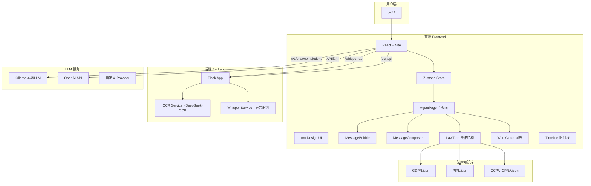
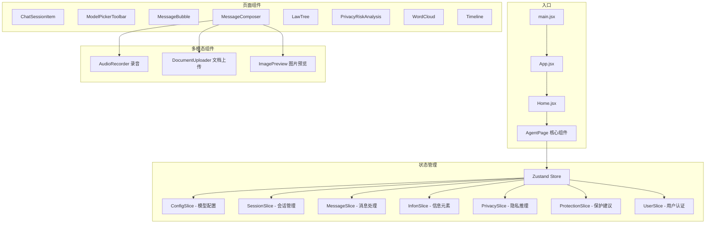
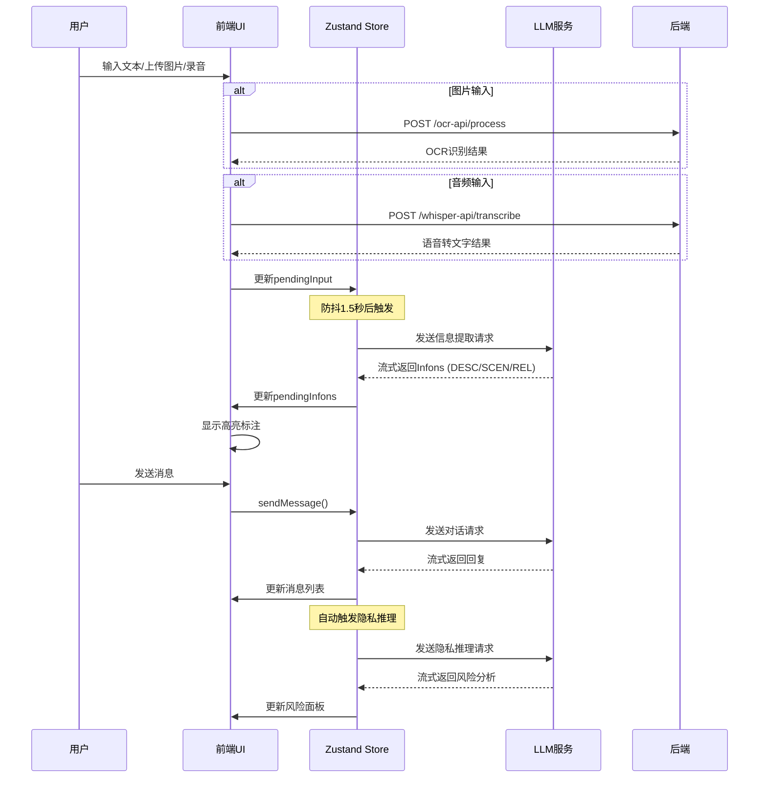
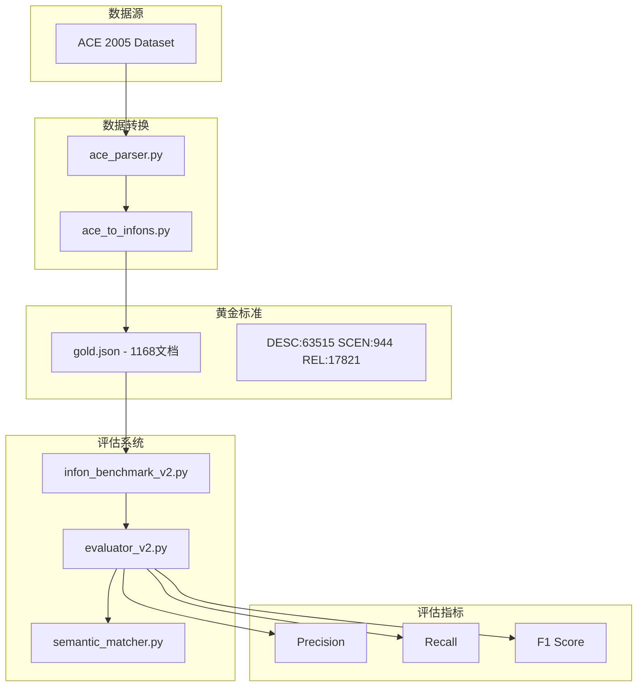
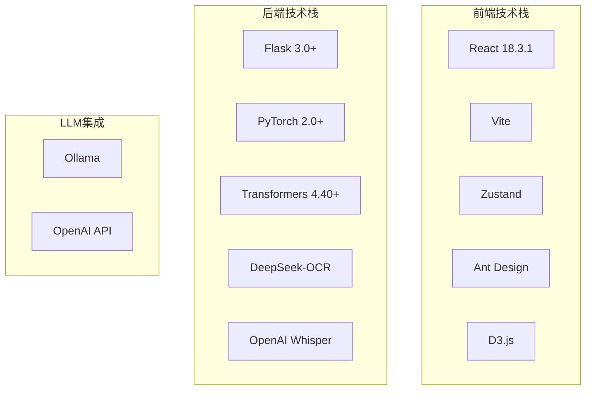

# PrivaSee - 隐私风险分析系统

PrivaSee 是一个基于大语言模型的**隐私风险分析系统**，通过提取文本、图像、音频中的信息元素（Infons），分析潜在隐私风险，并提供符合 GDPR、PIPL、CCPA 等法规的合规建议。

## 目录

- [系统架构](#系统架构)
- [前端架构](#前端架构)
- [后端架构](#后端架构)
- [核心业务流程](#核心业务流程)
- [基准测试模块](#基准测试模块)
- [技术栈](#技术栈)
- [快速开始](#快速开始)
- [API 文档](#api-文档)

---

## 系统架构

### 整体架构图



### 核心数据流

```
用户输入 → [OCR/Whisper] → 文本 → [LLM] → Infons → [LLM] → 隐私风险 → [LLM] → 保护建议
```

### 两种推理模式

| 模式 | 描述 | 适用场景 |
|------|------|----------|
| **Extract 模式** | 先提取 Infons（DESC/SCEN/REL），再进行隐私推理 | 需要详细信息标注 |
| **Direct 模式** | 直接对输入进行隐私分析，跳过信息提取 | 快速分析场景 |

---

## 前端架构

### 技术栈

- **框架**: React 18.3.1 + Vite
- **状态管理**: Zustand (Slice Pattern)
- **UI 组件库**: Ant Design
- **可视化**: D3.js
- **Markdown**: React Markdown

### 目录结构

```
frontend/
├── src/
│   ├── main.jsx                 # 应用入口
│   ├── App.jsx                  # 根组件
│   ├── store.js                 # Zustand Store 入口
│   ├── pages/Home.jsx           # 主页面容器
│   ├── components/
│   │   ├── AgentPage.jsx        # 核心页面组件
│   │   ├── agent/               # Agent 相关组件
│   │   ├── LawTree.jsx          # 法律结构可视化
│   │   ├── WordCloud.jsx        # 词云可视化
│   │   └── Timeline.jsx         # 时间线可视化
│   ├── store/slices/            # Zustand Slices
│   ├── hooks/                   # 自定义 Hooks
│   ├── templates/               # LLM 提示词模板
│   └── law/                     # 法律知识库 JSON
└── vite.config.js               # Vite 配置
```

### 组件架构图



### 状态管理 (Zustand Slices)

| Slice | 职责 | 关键状态 |
|-------|------|----------|
| ConfigSlice | 模型配置、推理模式 | conversationModel, inferenceMode |
| SessionSlice | 会话管理 | sessions, currentSessionId |
| MessageSlice | 消息处理 | messages, sendMessage() |
| InfonSlice | 信息元素提取 | pendingInfons, messageInfons |
| PrivacySlice | 隐私推理 | privacyRisks, sessionKeywords |
| ProtectionSlice | 保护建议 | protectionSuggestions |
| UserSlice | 用户认证 | user, isAuthenticated |

---

## 后端架构

### 技术栈

- **框架**: Flask 3.0+
- **深度学习**: PyTorch 2.0+, Transformers 4.40+
- **OCR**: DeepSeek-OCR (视觉语言模型)
- **语音识别**: OpenAI Whisper
- **GPU 加速**: CUDA, Flash Attention 2

### 目录结构

```
backend/
├── app.py                # Flask 应用入口
├── config.py             # 配置管理
├── requirements.txt      # Python 依赖
├── setup_conda_env.sh    # Conda 环境安装脚本
├── start.sh              # 启动脚本
└── services/
    ├── ocr_service.py    # OCR 服务
    └── whisper_service.py # Whisper 服务
```

### 服务架构图

```mermaid
graph TB
    subgraph "Flask Application"
        AppPy[app.py 应用入口]
        Config[config.py 配置管理]
        HealthAPI[/api/health]
        ServicesAPI[/api/services]
    end

    subgraph "OCR Service"
        OCRBlueprint[/api/ocr/*]
        OCRProcess[/process]
        OCRStream[/process/stream]
        FreeOCR[free_ocr - 文字识别]
        Markdown[markdown - Markdown转换]
        TableExtract[table_extract - 表格提取]
        VisualQA[visual_qa - 视觉问答]
    end

    subgraph "Whisper Service"
        WhisperBlueprint[/api/whisper/*]
        Transcribe[/transcribe]
    end

    subgraph "模型管理"
        DeepSeekOCR[DeepSeek-OCR]
        WhisperModel[OpenAI Whisper]
        LazyLoad[懒加载机制]
        AutoUnload[自动卸载 30s空闲]
    end

    AppPy --> OCRBlueprint
    AppPy --> WhisperBlueprint
    OCRBlueprint --> OCRProcess
    OCRBlueprint --> OCRStream
    OCRProcess --> FreeOCR
    OCRProcess --> Markdown
    OCRProcess --> TableExtract
    OCRProcess --> VisualQA
    WhisperBlueprint --> Transcribe

    OCRBlueprint --> DeepSeekOCR
    WhisperBlueprint --> WhisperModel
    DeepSeekOCR --> LazyLoad
    DeepSeekOCR --> AutoUnload
```

### OCR 服务功能

| 功能 | 描述 |
|------|------|
| free_ocr | 自由文字识别 |
| markdown | 文档转 Markdown |
| table_extract | 表格提取 |
| formula_extract | 公式提取 (LaTeX) |
| visual_qa | 视觉问答 |
| layout_analysis | 布局分析 |
| key_value_extract | 键值对提取 |

### 分辨率模式

| 模式 | 尺寸 | 适用场景 |
|------|------|----------|
| tiny | 512px | 快速预览 |
| small | 640px | 标准处理 |
| base | 1024px | 高质量 |
| large | 1280px | 超高质量 |
| gundam | 1024px + 智能裁切 | 推荐使用 |

---

## 核心业务流程

### 信息提取与隐私推理时序图



---

## 基准测试模块

### 概述

基准测试模块使用 **ACE 2005 数据集** 评估 PrivaSee 的信息提取准确性。

### 目录结构

```
benchmark/
├── ace_parser.py          # ACE 2005 XML/SGM 解析器
├── ace_to_infons.py       # ACE → Infon 格式转换
├── evaluator.py           # V1 评估器 (规则匹配)
├── evaluator_v2.py        # V2 评估器 (语义匹配)
├── semantic_matcher.py    # LLM 语义相似度
├── infon_benchmark_v2.py  # 批量测试
├── run_benchmark.py       # CLI 工具
├── gold_data/
│   ├── gold.json          # 黄金标准数据 (1168 文档)
│   └── statistics.json    # 统计信息
└── results/               # 评估结果
```

### 架构图



### 数据统计

| 指标 | 数量 |
|------|------|
| 文档数 | 1,168 |
| DESC (实体属性) | 63,515 |
| SCEN (时空场景) | 944 |
| REL (关系) | 17,821 |

### 使用方法

```bash
# 转换 ACE 数据
python -m benchmark.run_benchmark convert

# 运行评估
python -m benchmark.run_benchmark evaluate

# 模型对比
python -m benchmark.infon_benchmark_v2
```

---

## 技术栈

### 技术总览图



### 详细技术栈

| 类别 | 技术 | 版本 |
|------|------|------|
| 前端框架 | React | 18.3.1 |
| 构建工具 | Vite | latest |
| 状态管理 | Zustand | latest |
| UI 组件 | Ant Design | latest |
| 可视化 | D3.js | latest |
| 后端框架 | Flask | 3.0+ |
| 深度学习 | PyTorch | 2.0+ |
| OCR 模型 | DeepSeek-OCR | latest |
| 语音识别 | OpenAI Whisper | latest |

---

## 快速开始

### 环境要求

- **Node.js**: 18+
- **Python**: 3.10+
- **CUDA**: 11.8+ (可选，GPU 加速)
- **Ollama**: 已安装并运行

### 前端安装

```bash
cd frontend
npm install
npm run dev
```

### 后端安装

```bash
cd backend
bash setup_conda_env.sh
conda activate privasee
bash start.sh
```

### 配置 Ollama

```bash
curl -fsSL https://ollama.com/install.sh | sh
ollama pull qwen2.5:7b
ollama pull llava:7b
```

---

## API 文档

### 后端 API

#### 健康检查

```
GET /api/health
```

#### OCR 服务

```
POST /api/ocr/process
Content-Type: multipart/form-data

Parameters:
- file: 图片/PDF 文件
- command: free_ocr | markdown | table_extract | visual_qa
- resolution: tiny | small | base | large | gundam
- question: (可选) 用于 visual_qa
```

#### Whisper 服务

```
POST /api/whisper/transcribe
Content-Type: multipart/form-data

Parameters:
- file: 音频文件
- language: (可选) 语言代码
```

### 前端代理配置

| 路径 | 目标 |
|------|------|
| /v1/* | http://127.0.0.1:11434 (Ollama) |
| /api/* | http://127.0.0.1:11434 (Ollama) |
| /whisper-api/* | http://127.0.0.1:5000/api/whisper |
| /ocr-api/* | http://127.0.0.1:5000/api/ocr |

---

## 系统特性总结

| 模块 | 核心功能 | 关键技术 |
|------|----------|----------|
| 前端 | 多模态输入、实时高亮、隐私分析可视化 | React + Zustand + Ant Design |
| 后端 | OCR 识别、语音转文字 | Flask + DeepSeek-OCR + Whisper |
| LLM 集成 | 信息提取、隐私推理、保护建议 | Ollama / OpenAI API |
| 法律知识库 | GDPR/PIPL/CCPA 合规分析 | JSON 结构化法律条款 |
| 基准测试 | ACE 2005 数据集评估 | 语义匹配 + F1 指标 |

---

## License

MIT License

## Contributing

欢迎提交 Issue 和 Pull Request。
