# PrivaSee 论文流程图集

本文档包含适合用于论文的高质量流程图，使用Mermaid语法。

---

## Figure 1: 系统整体架构

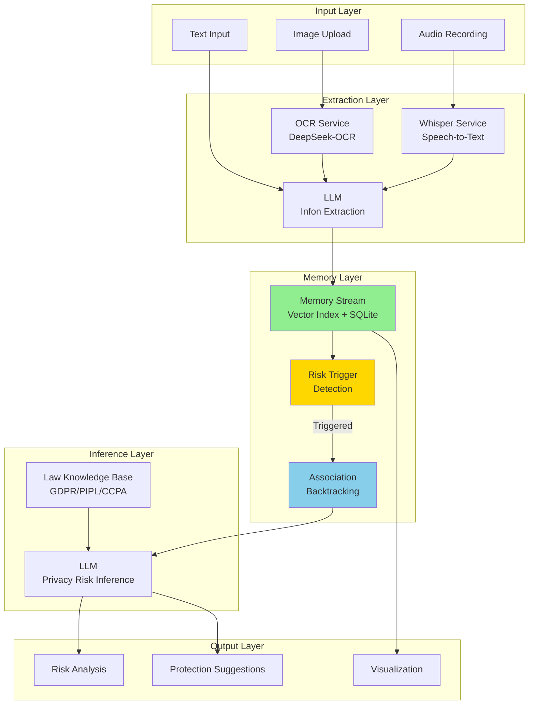

**说明**: 展示PrivaSee的五层架构，突出Memory Stream和Association Backtracking模块。

---

## Figure 2: 主记忆流触发决策流程

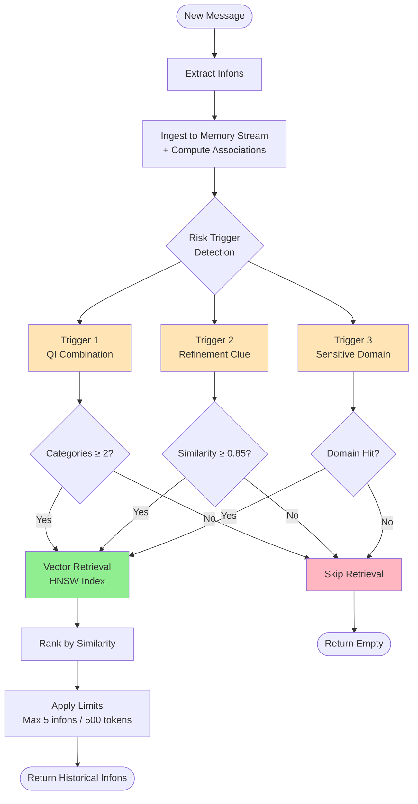

**说明**: 展示风险触发式可控检索的决策流程，三种触发器的OR逻辑。

---

## Figure 3: 准标识符组合检测详细流程

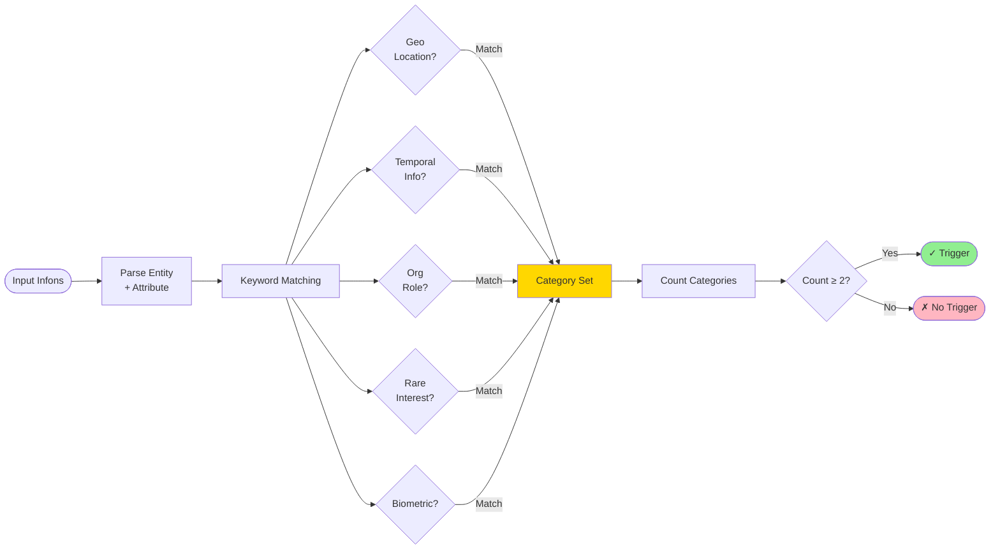

**说明**: 准标识符组合检测的详细流程，展示5大类别的分类逻辑。

---

## Figure 4: 关联回溯机制

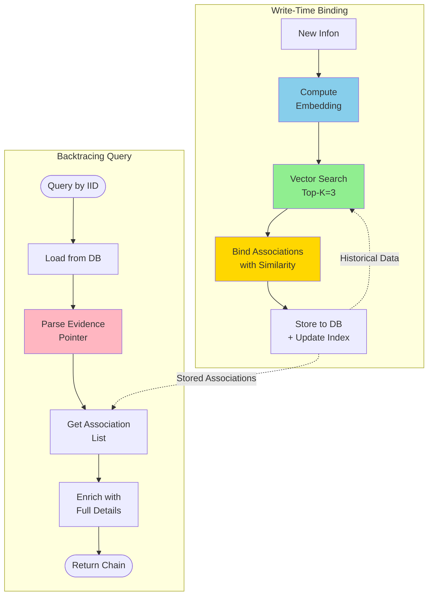

**说明**: 展示关联回溯的两个核心流程：写入时绑定和回溯查询。

---

## Figure 5: 证据指针格式与解析

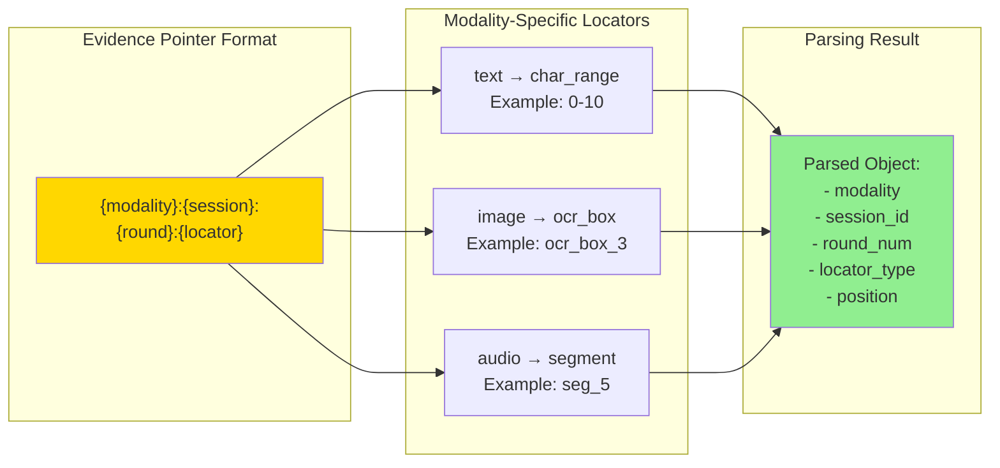

**说明**: 统一跨模态证据指针的格式和解析逻辑。

---

## Figure 6: 信息元关联网络示例

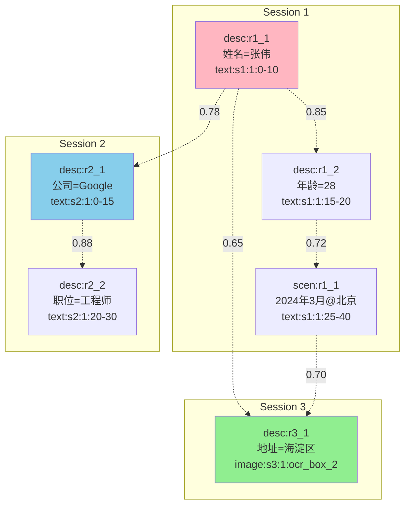

**说明**: 展示跨会话的信息元关联网络，边权重表示语义相似度。

---

## Figure 7: 提示词工程四层结构

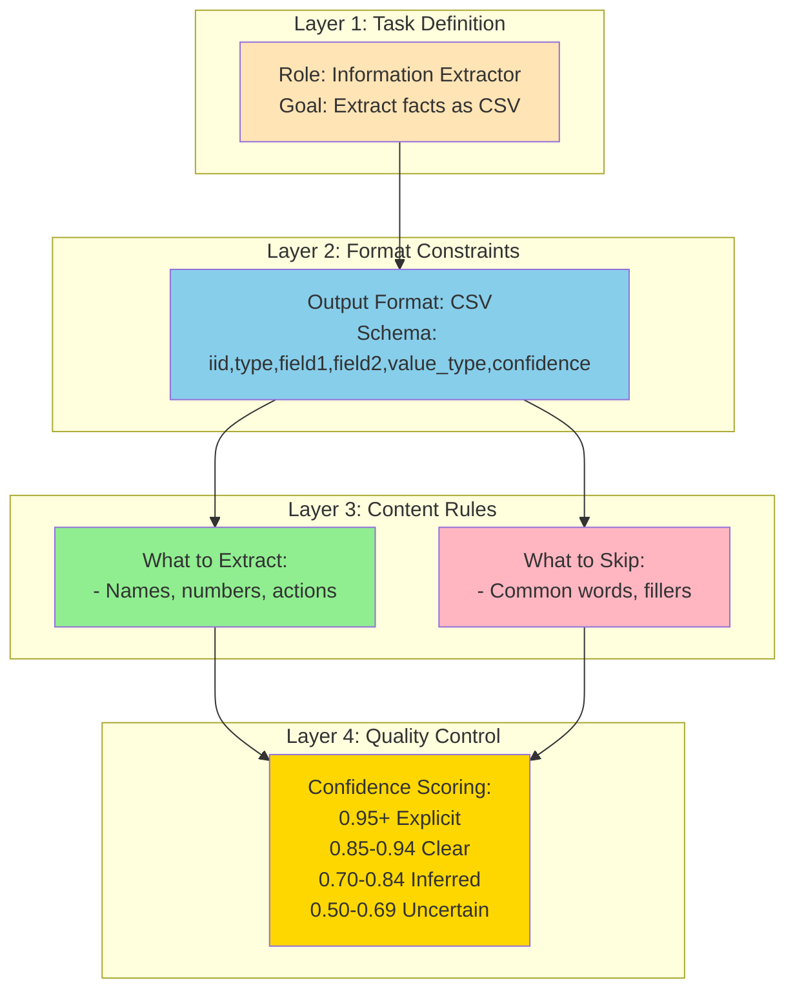

**说明**: 展示针对小参数LLM的提示词工程四层结构。

---

## Figure 8: HNSW向量索引结构

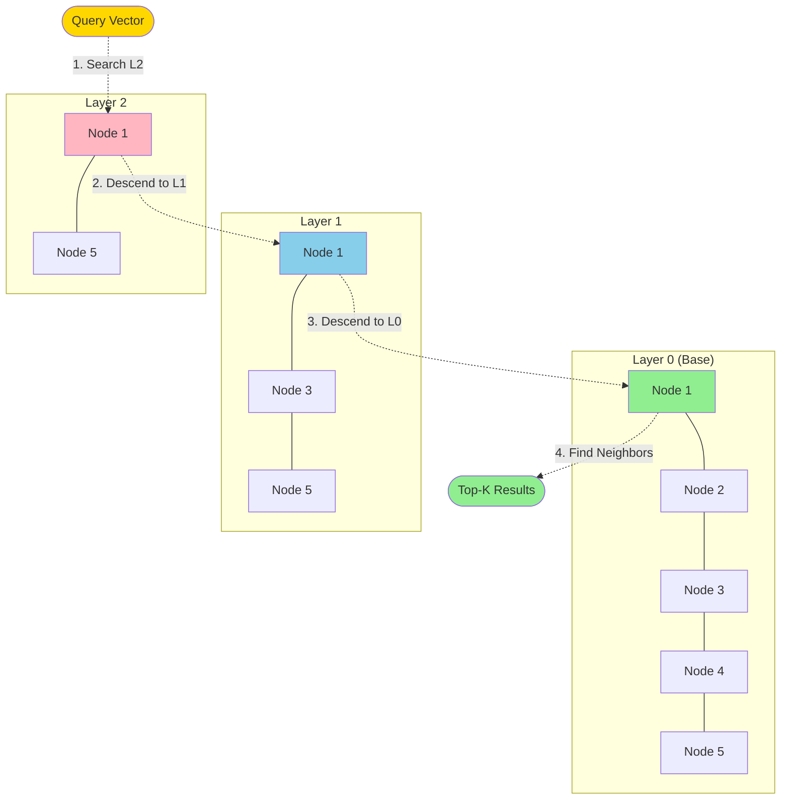

**说明**: HNSW分层图结构，展示从顶层到底层的搜索路径。

---

## Figure 9: 隐私拼图攻击场景

```mermaid
flowchart TD
    subgraph "Attacker's View"
        A1[Round 1: "我叫张伟"]
        A2[Round 2: "在Google工作"]
        A3[Round 3: "住在北京海淀区"]
        A4[Round 4: "1994年出生"]
    end
    
    subgraph "Puzzle Assembly"
        P1["姓名: 张伟"]
        P2["公司: Google"]
        P3["地址: 北京海淀区"]
        P4["年龄: ~30岁"]
    end
    
    subgraph "Re-identification"
        R1["Search: Google员工 + 北京 + 30岁 + 张伟"]
        R2["Result: Unique Individual Identified"]
    end
    
    A1 --> P1
    A2 --> P2
    A3 --> P3
    A4 --> P4
    
    P1 --> R1
    P2 --> R1
    P3 --> R1
    P4 --> R1
    
    R1 --> R2
    
    style R2 fill:#FF6B6B
    style R1 fill:#FFD700
```

**说明**: 展示隐私拼图攻击的场景，多条看似无害的信息组合后可重识别个人。

---

## Figure 10: 系统性能对比

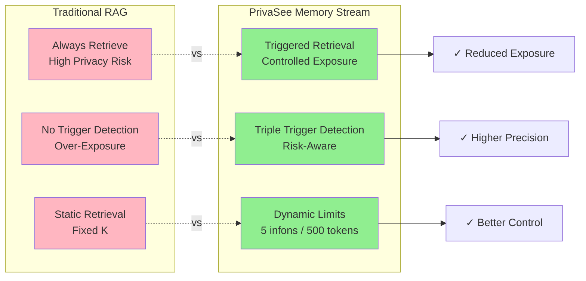

**说明**: 对比传统RAG和PrivaSee的风险触发式检索机制。

---

## 使用指南

### 在Markdown中渲染

这些Mermaid图可以直接在支持Mermaid的Markdown渲染器中显示，如：
- GitHub
- GitLab
- Obsidian
- Typora
- VS Code (with Mermaid extension)

### 导出为图片

**方法1: 使用Mermaid Live Editor**
1. 访问 https://mermaid.live/
2. 粘贴代码
3. 导出为PNG/SVG

**方法2: 使用命令行工具**
```bash
# 安装 mermaid-cli
npm install -g @mermaid-js/mermaid-cli

# 转换为PNG
mmdc -i flowchart.mmd -o flowchart.png

# 转换为SVG (矢量图，推荐用于论文)
mmdc -i flowchart.mmd -o flowchart.svg
```

**方法3: 使用Python**
```python
from mermaid import Mermaid

mermaid_code = """
graph TB
    A --> B
"""

Mermaid(mermaid_code).to_png('output.png')
```

### 论文中的使用建议

**图表编号与标题**:
- Figure 1: System Architecture of PrivaSee
- Figure 2: Risk-Triggered Retrieval Decision Flow
- Figure 3: Quasi-Identifier Combination Detection
- Figure 4: Association Backtracking Mechanism
- Figure 5: Cross-Modal Evidence Pointer Format
- Figure 6: Information Element Association Network
- Figure 7: Four-Layer Prompt Engineering Structure
- Figure 8: HNSW Vector Index Structure
- Figure 9: Privacy Puzzle Attack Scenario
- Figure 10: Performance Comparison with Traditional RAG

**图表说明示例**:
> **Figure 2**: Risk-Triggered Retrieval Decision Flow. The system employs three triggers (QI combination, refinement clue, and sensitive domain hit) to determine whether to retrieve historical infons. Only when at least one trigger is activated, the system performs vector retrieval with hard limits (max 5 infons or 500 tokens) to balance privacy protection and information utility.

---

## 自定义样式

### 修改颜色

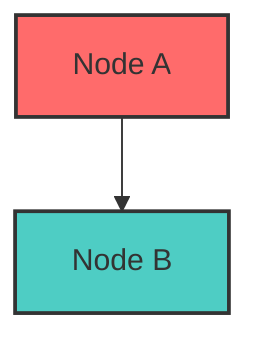

### 常用配色方案

| 用途 | 颜色代码 | 示例 |
|-----|---------|------|
| 成功/通过 | `#90EE90` | 浅绿色 |
| 警告/注意 | `#FFD700` | 金黄色 |
| 错误/拒绝 | `#FFB6C1` | 浅粉色 |
| 信息/中性 | `#87CEEB` | 浅蓝色 |
| 强调/重要 | `#FFE4B5` | 浅橙色 |
| 危险/高风险 | `#FF6B6B` | 红色 |

---

## 高级技巧

### 子图嵌套

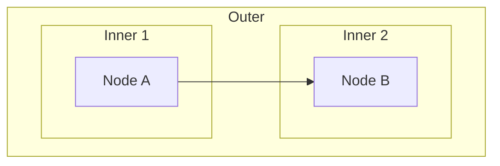

### 条件分支

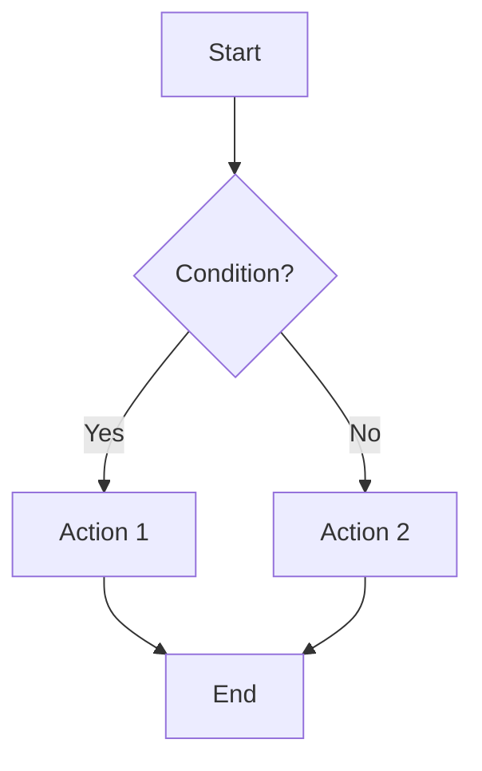

### 时序图 (可选)

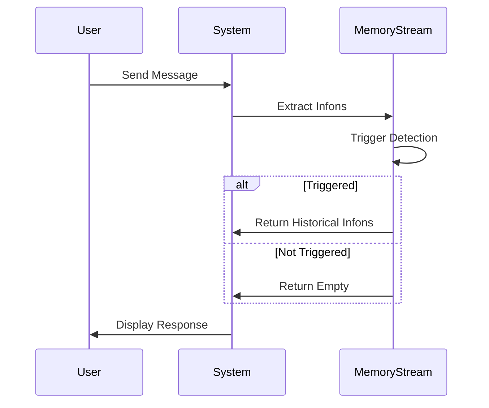

---

## 版本记录

- **v1.0** (2025-02-09): 初始版本，包含10个核心流程图
- **待更新**: 根据审稿意见调整图表样式

---

**作者**: PrivaSee Team  
**用途**: 论文插图、演示文稿、技术文档  
**许可**: MIT

