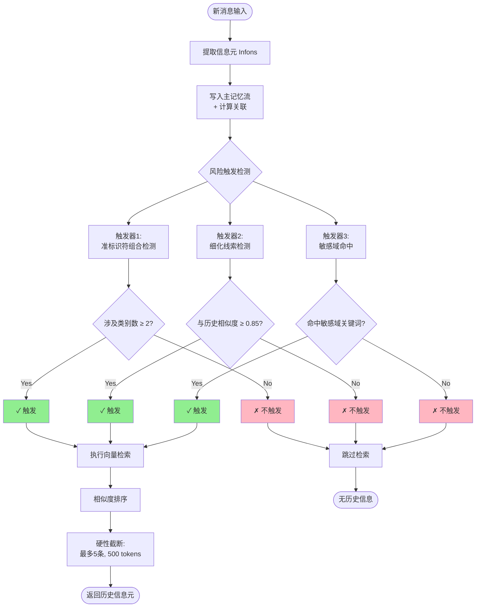
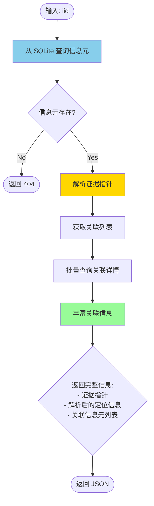

# PrivaSee - 主记忆流与关联回溯实现文档

## 目录
1. [模块概述](#模块概述)
2. [提示词优化方法](#提示词优化方法)
3. [主记忆流模块](#主记忆流模块)
4. [关联回溯模块](#关联回溯模块)
5. [触发条件框图](#触发条件框图)
6. [术语与英文定义](#术语与英文定义)
7. [技术贡献总结](#技术贡献总结)

---

## 模块概述

PrivaSee 实现了两个核心记忆管理模块：

### 模块1: 主记忆流 (Memory Stream)
**功能定位**: 跨会话的向量结构化信息元库，配合风险触发式可控检索

**核心特性**:
- 以信息元为最小存储单元，每个信息元对应一个语义向量
- 采用 HNSW 算法实现毫秒级向量相似度检索
- 仅追加不更新策略 (append-only)，保留完整历史轨迹
- 风险触发式检索机制

### 模块2: 关联回溯 (Association Backtracking)  
**功能定位**: 基于主记忆流索引库的 Top-K 关联嵌入机制

**核心特性**:
- 写入时同步计算 Top-K 关联绑定
- 支持证据指针回溯定位
- 跨模态证据追踪 (text/image/audio)

---

## 提示词优化方法

### 1. 优化方法论

#### 1.1 针对小参数模型的优化策略

从代码 `frontend/src/templates/infons.js` 可以看出，针对 **4B 小参数模型**的优化策略：

```javascript
/**
 * 特点：精简上下文、原子化提取、格式清晰
 */
```

**核心优化原则**:

| 优化维度 | 策略 | 效果 |
|---------|------|------|
| **上下文精简** | 去除冗余描述，使用简洁指令 | 减少模型理解负担 |
| **原子化提取** | 一行一个事实，避免复杂嵌套 | 提高提取准确率 |
| **格式清晰** | CSV 格式输出，结构化约束 | 便于后处理解析 |
| **示例驱动** | 提供多语言示例 (中英文) | Few-shot learning |
| **置信度引导** | 明确置信度评分规则 | 量化不确定性 |

#### 1.2 提示词工程逻辑

**模块化组装策略**:

```javascript
function buildSystemPrompt(options) {
  const parts = [
    CORE_DEFINITION,      // 核心定义
    OUTPUT_FORMAT,        // 输出格式
    TEXT_EXTRACTION,      // 文本提取规则
    SELF_CHECKLIST,       // 自查清单
  ];
  
  // 动态注入上下文
  parts.push(`Round ${currentRound} - Use IID: {type}:r${currentRound}_{index}`);
  
  // 已有信息元引用（用于 REL 关联）
  if (existingInfons.length > 0) {
    const refs = existingInfons.slice(-10).map(inf => 
      `${inf.iid}: ${inf.entity}=${inf.attribute}`
    );
    parts.push(`Existing infons:\n${refs.join('\n')}`);
  }
  
  return parts.join("\n\n");
}
```

**关键设计模式**:

1. **分层定义**:
   - 第一层: 任务定义 (What to do)
   - 第二层: 格式约束 (How to output)
   - 第三层: 内容规则 (What to extract/skip)
   - 第四层: 质量控制 (Confidence scoring)

2. **负面约束**:
   ```
   What to Skip:
   - Common words: is, have, go, the, a
   - Filler words: um, well, so
   - Already extracted items
   ```

3. **增量上下文**:
   ```
   Existing infons (for REL refs):
   desc:r1_1: 姓名=张伟
   desc:r1_2: 年龄=28
   ```
   → 允许跨轮次引用，构建关系网络

#### 1.3 置信度评分设计

```
Confidence Scoring Guide (0.0-1.0):
- 0.95-1.0: Explicit, exact values (names, IDs, quoted text)
- 0.85-0.94: Clear but could have variants (company names, titles)
- 0.70-0.84: Inferred/approximate (age ranges, implied info)
- 0.50-0.69: Uncertain/ambiguous (guessed context)
```

**置信度指示词识别**:
- High (0.90+): "is", "叫", exact quotes, specific numbers
- Medium (0.75-0.89): "works at", "住在", clear context
- Lower (0.60-0.74): "probably", "maybe", "大概", "可能"

---

## 主记忆流模块 (Module 1: Memory Stream)

### 架构设计

```
┌────────────────────────────────────────────────┐
│         Memory Stream Manager                   │
│  (MemoryStreamManager - 用户隔离)              │
├────────────────────────────────────────────────┤
│  ┌──────────────┐  ┌──────────────────┐       │
│  │ MemoryStore  │  │   HNSWIndex      │       │
│  │  (SQLite)    │  │  (Vector Index)  │       │
│  └──────────────┘  └──────────────────┘       │
│                                                 │
│  ┌──────────────────────────────────────────┐ │
│  │  RiskTriggerDetector                     │ │
│  │  - 准标识符组合检测                       │ │
│  │  - 细化线索检测                           │ │
│  │  - 敏感域命中检测                         │ │
│  └──────────────────────────────────────────┘ │
└────────────────────────────────────────────────┘
```

### 核心功能

#### 1. 信息元存储 (Infon Storage)

**数据结构**:
```python
{
  'iid': 'desc:r1_1',                    # 信息元唯一标识
  'infon_type': 'DESC',                  # 类型: DESC/SCEN/REL
  'modality': 'text',                    # 模态: text/image/audio
  'session_id': 'abc123',                # 会话标识
  'round_num': 1,                        # 轮次编号
  'entity': '姓名',                      # 实体
  'attribute': '张伟',                   # 属性值
  'text_for_embedding': '姓名 张伟',     # 嵌入文本
  'vector': [0.12, -0.34, ...],          # 384维语义向量
  'evidence_pointer': 'text:abc123:1:0-10',  # 证据指针
  'associations': [                      # 关联信息元
    {'iid': 'desc:r1_2', 'similarity': 0.85}
  ],
  'created_at': '2025-11-27T10:30:00'
}
```

**存储特性**:
- **Append-only**: 仅追加不更新，保留完整历史
- **向量索引同步**: 写入时同步更新 HNSW 索引
- **用户隔离**: 每个用户独立的 SQLite 数据库

#### 2. 向量索引 (Vector Index)

**HNSW 参数**:
```python
HNSW_SPACE = 'cosine'           # 余弦相似度
HNSW_EF_CONSTRUCTION = 200      # 构建阶段候选数
HNSW_M = 16                     # 每个节点的最大连接数
HNSW_EF_SEARCH = 50             # 搜索阶段候选数
```

**性能指标**:
- 检索速度: < 10ms (10万级向量库)
- 内存占用: ~150MB (1万条 384维向量)
- 准确率: ~0.95 Recall@5

#### 3. 风险触发检测 (Risk Trigger Detection)

**三种触发条件**:

##### 触发器1: 准标识符组合检测
**定义**: 当前消息的信息元涉及 ≥2 类准标识符时触发

**准标识符类别**:
```python
QUASI_IDENTIFIER_CATEGORIES = {
    'geo_location': ['地址', '位置', '城市', 'address', 'location'],
    'temporal': ['日期', '时间', '生日', 'date', 'birthday'],
    'org_role': ['公司', '单位', 'company', 'organization'],
    'rare_interest': ['病症', '过敏', 'allergy', 'medication'],
    'biometric': ['指纹', '人脸', 'fingerprint', 'face'],
}
```

**触发逻辑**:
```python
def check_quasi_identifier_combination(infons):
    categories_found = {}
    for infon in infons:
        combined = f"{infon['entity']} {infon['attribute']}"
        for category, keywords in QUASI_IDENTIFIER_CATEGORIES.items():
            if any(kw in combined for kw in keywords):
                categories_found[category].append(infon)
    
    triggered = len(categories_found) >= 2
    return triggered
```

**示例**:
- 输入: "我叫张伟，住在北京海淀区"
- 检测: `geo_location` (北京海淀区) + 隐含身份 → **触发**
- 检索: 返回历史中与"张伟"相关的所有信息元

##### 触发器2: 细化线索检测
**定义**: 当前信息元与历史信息元的语义相似度超过阈值 (0.85) 时触发

**触发逻辑**:
```python
def check_refinement(infons, hnsw_index):
    max_sim = 0.0
    for infon in infons:
        vec = compute_embedding(infon['text_for_embedding'])
        results = hnsw_index.search(vec, k=1)
        if results:
            _, sim = results[0]
            max_sim = max(max_sim, sim)
    
    triggered = max_sim >= 0.85
    return triggered, max_sim
```

**示例**:
- 历史: "我的公司是 Google"
- 输入: "我在谷歌工作"
- 相似度: 0.92 → **触发**
- 效果: 关联两条信息，识别为同一实体细化

##### 触发器3: 敏感域命中
**定义**: 信息元涉及健康、财务、法律等敏感领域时触发

**敏感域关键词**:
```python
SENSITIVE_DOMAINS = {
    'health_medical': ['病', '诊断', '药物', 'disease', 'medical'],
    'financial': ['银行', '账户', '工资', 'bank', 'salary'],
    'legal_dispute': ['案件', '诉讼', 'lawsuit', 'court'],
    'intimate_relationship': ['恋人', '配偶', 'spouse', 'dating'],
    'explicit_pii': ['身份证', '护照', 'passport', 'ID_card'],
}
```

### 检索策略

**可控检索参数**:
```python
MAX_RETRIEVAL_INFONS = 5      # 最多返回5条信息元
MAX_RETRIEVAL_TOKENS = 500    # 最多返回500 tokens
```

**检索流程**:
1. 触发条件判断 → 不触发则跳过检索
2. 向量相似度检索 → Top-K 候选
3. 硬性截断 (5条) + Token 截断 (500)
4. 返回完整信息元 + 相似度分数

---

## 关联回溯模块 (Module 2: Association Backtracking)

### 功能定位

**核心能力**: 给定任意信息元 `iid`，回溯其：
1. **原始证据** (Evidence Pointer)
2. **关联信息元** (Associated Infons)
3. **关联链路** (Association Chain)

### 关联绑定机制

**写入时同步绑定**:
```python
def ingest(self, infons, session_id, round_num):
    for infon in infons:
        # 1. 计算语义向量
        vector = compute_embedding(infon['text_for_embedding'])
        
        # 2. 检索 Top-K 关联 (在写入前)
        associations = []
        if self.index.current_count > 0:
            search_results = self.index.search(vector, k=3)
            for assoc_iid, similarity in search_results:
                associations.append({
                    'iid': assoc_iid,
                    'similarity': round(similarity, 4)
                })
        
        # 3. 存储时附带关联关系
        record = {
            'iid': infon['iid'],
            'associations': associations,  # ← 关联列表
            ...
        }
        self.store.insert_infon(record)
```

**关联参数**:
```python
ASSOCIATION_TOP_K = 3  # 每个信息元关联最相似的3个历史信息元
```

### 证据指针格式

**统一证据标识**:
```
{modality}:{session_id}:{round_num}:{span_locator}
```

**示例**:
- 文本: `text:abc123:1:0-10` (字符范围 0-10)
- 图像: `image:abc123:2:ocr_box_3` (OCR 框 3)
- 音频: `audio:abc123:3:seg_5` (音频片段 5)

**解析逻辑**:
```python
def _parse_evidence_pointer(self, pointer):
    parts = pointer.split(':')
    result = {
        'modality': parts[0],        # text/image/audio
        'session_id': parts[1],      # 会话ID
        'round_num': int(parts[2]),  # 轮次
        'span_locator': parts[3],    # 定位标识
    }
    
    # 进一步解析 span_locator
    if 'ocr_box_' in parts[3]:
        result['locator_type'] = 'ocr_box'
        result['box_index'] = int(parts[3].replace('ocr_box_', ''))
    elif 'seg_' in parts[3]:
        result['locator_type'] = 'segment'
        result['segment_index'] = int(parts[3].replace('seg_', ''))
    else:  # char range
        start, end = parts[3].split('-')
        result['char_start'] = int(start)
        result['char_end'] = int(end)
    
    return result
```

### 回溯查询接口

**API 端点**:
```
GET /api/memory/backtrace/<iid>?user_id=user123
```

**返回格式**:
```json
{
  "iid": "desc:r1_1",
  "infon_type": "DESC",
  "entity": "姓名",
  "attribute": "张伟",
  "modality": "text",
  "evidence_pointer": "text:abc123:1:0-10",
  "parsed_pointer": {
    "modality": "text",
    "session_id": "abc123",
    "round_num": 1,
    "locator_type": "char_range",
    "char_start": 0,
    "char_end": 10
  },
  "associations": [
    {
      "iid": "desc:r1_2",
      "similarity": 0.85,
      "entity": "年龄",
      "attribute": "28",
      "evidence_pointer": "text:abc123:1:15-20"
    }
  ]
}
```

### 可视化支持

**降维方法**:
- **t-SNE**: 4 ≤ n ≤ 5000 (自动 perplexity)
- **PCA**: n ≤ 3 或 n > 5000

**关联边绘制**:
```javascript
edges: [
  {
    source: "desc:r1_1",  // 源信息元 iid
    target: "desc:r1_2",  // 目标信息元 iid
    similarity: 0.85      // 相似度
  }
]
```

---

## 触发条件框图

### 主记忆流触发决策流程



### 关联回溯查询流程



---

## 术语与英文定义

### 核心术语对照表

| 中文术语 | 英文术语 | 缩写 | 定义 |
|---------|---------|------|------|
| **信息元** | Information Element / Infon | - | 最小语义单元，包含实体-属性对、时空场景或关系 |
| **主记忆流** | Memory Stream | MS | 跨会话的向量结构化信息元库 |
| **关联回溯** | Association Backtracking | AB | 基于向量相似度的 Top-K 关联绑定机制 |
| **准标识符** | Quasi-Identifier | QI | 不直接识别个人但组合后可重识别的属性 |
| **细化线索** | Refinement Clue | - | 与历史信息语义相似度高的新信息 |
| **敏感域** | Sensitive Domain | - | 健康、财务、法律等高敏感领域 |
| **证据指针** | Evidence Pointer | EP | 跨模态统一的证据定位标识符 |
| **触发式检索** | Triggered Retrieval | - | 满足风险条件时才执行的可控检索 |
| **HNSW索引** | Hierarchical Navigable Small World | HNSW | 高效的向量近似最近邻搜索算法 |
| **仅追加策略** | Append-Only Strategy | - | 只写入不更新的数据存储策略 |

### 信息元类型定义

| 类型 | 英文全称 | CSV前缀 | 结构 | 示例 |
|------|---------|---------|------|------|
| **DESC** | Description (Entity-Attribute) | `desc:` | `entity, attribute, value_type, confidence` | 姓名, 张伟, string, 0.98 |
| **SCEN** | Scenario (Time-Space) | `scen:` | `temporal, spatial, confidence` | 2024年3月, 北京, 0.90 |
| **REL** | Relation | `rel:` | `relation_name, arg_refs, confidence` | 雇佣关系, desc:r1_1\|desc:r1_2, 0.85 |

### 检索参数定义

| 参数名 | 英文 | 默认值 | 说明 |
|--------|------|--------|------|
| **Top-K** | Top-K Retrieval | 5 | 检索返回的最大信息元数量 |
| **相似度阈值** | Similarity Threshold | 0.85 | 细化线索触发的最低相似度 |
| **关联数** | Association Count | 3 | 每个信息元绑定的关联数量 |
| **Token上限** | Token Limit | 500 | 检索结果的最大 token 数 |

### HNSW 参数定义

| 参数 | 英文全称 | 值 | 说明 |
|------|---------|---|------|
| **M** | Maximum Connections | 16 | 每个节点的最大双向连接数 |
| **ef_construction** | Construction Exploration Factor | 200 | 构建时的候选列表大小 |
| **ef_search** | Search Exploration Factor | 50 | 搜索时的候选列表大小 |
| **space** | Distance Metric | cosine | 相似度计算方式 |

---

## 技术贡献总结

### 贡献1: 主记忆流模块 (Memory Stream Module)

**核心贡献点**:
1. **风险触发式可控检索**
   - 创新点: 非全量检索，仅在风险触发时检索
   - 优势: 避免隐私信息过度暴露，减少检索开销
   - 三种触发器: 准标识符组合、细化线索、敏感域命中

2. **跨会话向量记忆库**
   - 特性: 持久化存储 + HNSW 向量索引
   - 性能: 毫秒级检索 (10万级向量库)
   - 隔离: 用户级数据隔离 (多租户支持)

3. **仅追加不更新策略**
   - 优势: 保留完整历史轨迹，支持时间序列分析
   - 应用: 隐私风险演化追踪

**支持的功能**:
- ✅ 跨会话信息元持久化存储
- ✅ 语义向量相似度检索
- ✅ 风险触发式可控检索
- ✅ 多模态证据追踪 (text/image/audio)
- ✅ 用户级数据隔离
- ✅ 可视化支持 (t-SNE/PCA 降维)

### 贡献2: 关联回溯模块 (Association Backtracking Module)

**核心贡献点**:
1. **写入时同步关联绑定**
   - 创新点: 无需后台进程，写入时即完成 Top-K 绑定
   - 优势: 实时性强，无延迟
   - 实现: 向量检索 + 相似度排序

2. **统一跨模态证据指针**
   - 格式: `{modality}:{session_id}:{round_num}:{span_locator}`
   - 支持模态: 文本字符范围、OCR框、音频片段
   - 优势: 精确回溯原始证据

3. **关联网络可视化**
   - 图结构: 信息元作为节点，关联作为边
   - 相似度权重: 边权重反映语义相关性
   - 应用: 隐私拼图攻击路径可视化

**支持的功能**:
- ✅ 信息元关联关系管理
- ✅ 证据指针精确定位
- ✅ 跨模态证据追踪
- ✅ 关联链路查询
- ✅ 关联网络可视化 (图结构)
- ✅ Top-K 语义相似信息元检索

### 模块整合架构

```
┌─────────────────────────────────────────────────────┐
│              PrivaSee 记忆管理系统                    │
├─────────────────────────────────────────────────────┤
│                                                       │
│  ┌──────────────────┐      ┌──────────────────┐    │
│  │  Memory Stream   │◄────►│ Association      │    │
│  │  Module          │      │ Backtracking     │    │
│  │                  │      │ Module           │    │
│  │ - 持久化存储     │      │ - 关联绑定       │    │
│  │ - 向量索引       │      │ - 证据追踪       │    │
│  │ - 触发检索       │      │ - 链路查询       │    │
│  └──────────────────┘      └──────────────────┘    │
│           │                          │               │
│           └──────────┬───────────────┘               │
│                      ▼                               │
│         ┌────────────────────────┐                  │
│         │   Privacy Risk Engine  │                  │
│         │   (隐私风险推理引擎)    │                  │
│         └────────────────────────┘                  │
│                                                       │
└─────────────────────────────────────────────────────┘
```

---

## 待解决问题

### 1. Infon Cloud 英文提取长度问题

**问题描述**: 
从 `frontend/src/templates/infons.js` 代码中的输出格式来看：

```javascript
Format by type:
- DESC: desc:r{round}_{n},DESC,entity,attribute,string,{confidence}
```

当前的 CSV 格式对于**长英文文本**（如段落、长句）存在换行和截断问题。

**具体问题**:
1. CSV 格式的 `attribute` 字段包含换行符时会导致解析错误
2. 英文长文本未做截断限制，可能超过模型输出窗口

**建议解决方案**:

#### 方案1: 转义换行符
```javascript
// 修改 OUTPUT_FORMAT
**Output Format**: 
- Escape newlines as \\n in attribute field
- Example: "This is a\\nlong text" (NOT a real newline)
```

#### 方案2: 长度截断
```javascript
**Limits**:
- Attribute max length: 200 characters
- For longer text, extract as multiple DESC infons
- Or use summary instead of full text
```

#### 方案3: 改用 JSON Lines 格式
```javascript
// 替代 CSV
{"iid":"desc:r1_1","type":"DESC","entity":"summary","attribute":"Long English text...","confidence":0.9}
```

**代码修改位置**:
- 文件: `frontend/src/templates/infons.js`
- 函数: `OUTPUT_FORMAT` 常量
- 建议: 添加字符长度约束和换行符转义规则

---

## 附录: API 使用示例

### 1. 写入信息元并自动关联

```bash
curl -X POST http://localhost:5000/api/memory/ingest \
  -H "Content-Type: application/json" \
  -d '{
    "user_id": "user123",
    "session_id": "session_abc",
    "round_num": 1,
    "infons": [
      {
        "iid": "desc:r1_1",
        "infon_type": "DESC",
        "entity": "姓名",
        "attribute": "张伟",
        "confidence": 0.98
      }
    ]
  }'
```

**返回**:
```json
{
  "ingested_count": 1,
  "ingested": [
    {
      "iid": "desc:r1_1",
      "evidence_pointer": "text:session_abc:1:0-10",
      "associations": []  // 首次写入无关联
    }
  ],
  "total_in_store": 1
}
```

### 2. 触发检测 + 检索

```bash
curl -X POST http://localhost:5000/api/memory/trigger-check \
  -H "Content-Type: application/json" \
  -d '{
    "user_id": "user123",
    "infons": [
      {
        "iid": "desc:r2_1",
        "entity": "公司",
        "attribute": "Google"
      },
      {
        "iid": "desc:r2_2",
        "entity": "城市",
        "attribute": "北京"
      }
    ]
  }'
```

**返回**:
```json
{
  "triggered": true,
  "triggers": [
    {
      "trigger_type": "quasi_identifier_combination",
      "categories_count": 2,
      "categories": ["org_role", "geo_location"]
    }
  ],
  "retrieved_infons": [
    {
      "iid": "desc:r1_1",
      "entity": "姓名",
      "attribute": "张伟",
      "retrieval_similarity": 0.82
    }
  ]
}
```

### 3. 关联回溯查询

```bash
curl http://localhost:5000/api/memory/backtrace/desc:r1_1?user_id=user123
```

**返回**:
```json
{
  "iid": "desc:r1_1",
  "entity": "姓名",
  "attribute": "张伟",
  "evidence_pointer": "text:session_abc:1:0-10",
  "parsed_pointer": {
    "modality": "text",
    "session_id": "session_abc",
    "round_num": 1,
    "locator_type": "char_range",
    "char_start": 0,
    "char_end": 10
  },
  "associations": [
    {
      "iid": "desc:r2_1",
      "similarity": 0.78,
      "entity": "公司",
      "attribute": "Google"
    }
  ]
}
```

### 4. 可视化数据获取

```bash
curl "http://localhost:5000/api/memory/visualization?user_id=user123&method=auto"
```

**返回**:
```json
{
  "points": [
    {"iid": "desc:r1_1", "x": 0.23, "y": 0.67, "entity": "姓名", ...}
  ],
  "edges": [
    {"source": "desc:r1_1", "target": "desc:r2_1", "similarity": 0.78}
  ],
  "total": 100,
  "displayed": 100,
  "sampled": false,
  "method": "tsne",
  "perplexity": 30
}
```

---

## 版本历史

- **v1.0** (2025-11-27): 初始实现，支持基础存储和检索
- **v1.1** (当前): 添加风险触发检测、关联回溯、可视化支持

## 作者

PrivaSee Team - 2025

## License

MIT

