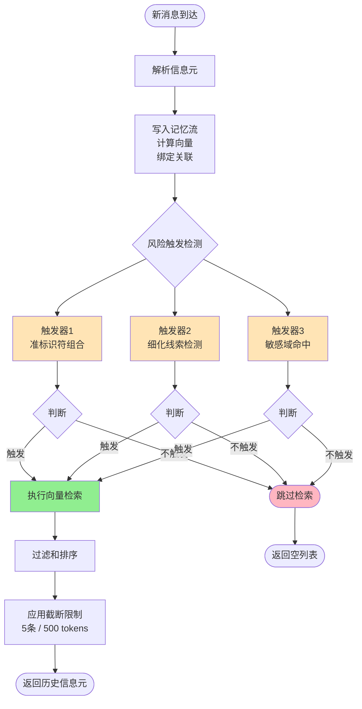
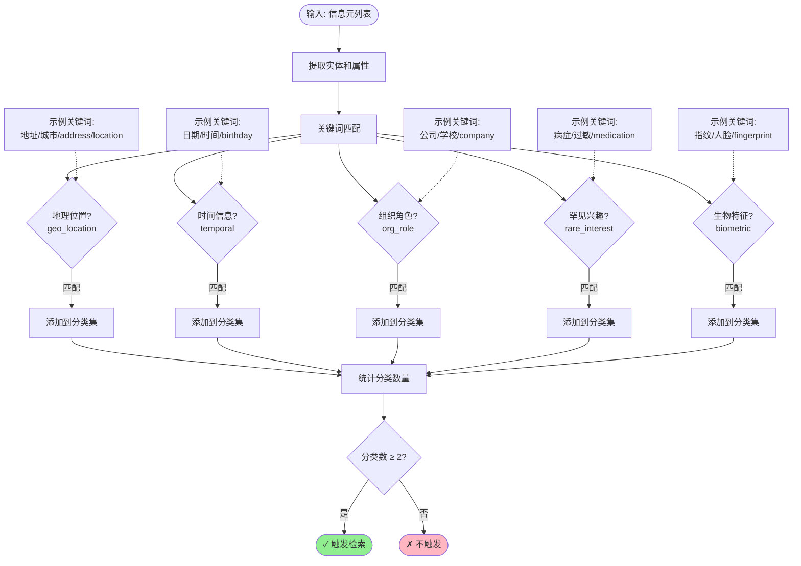
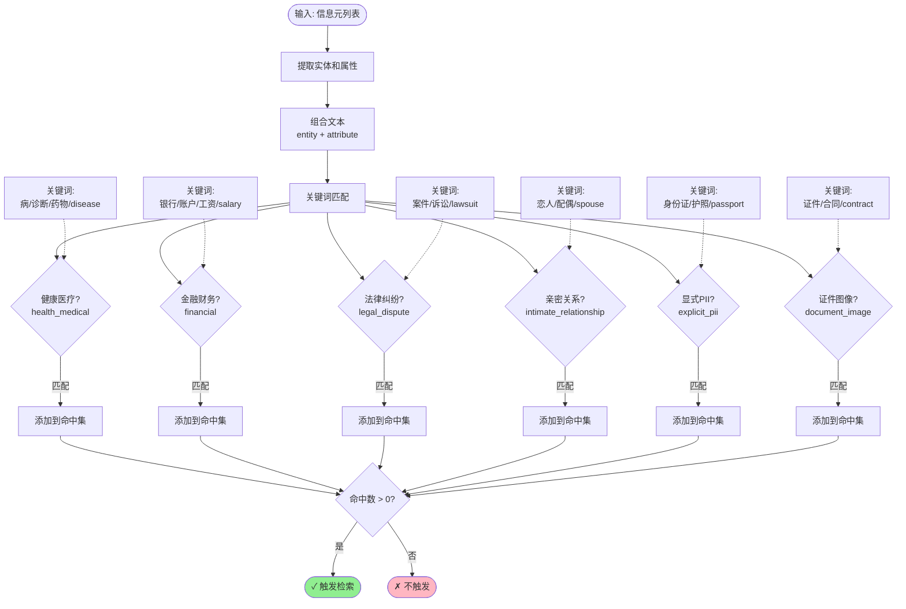
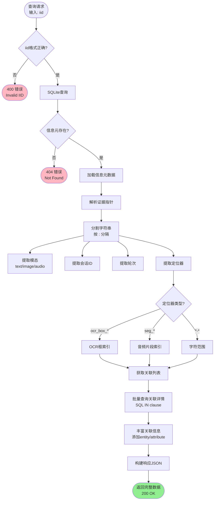

# PrivaSee - 术语对照与流程框图

## 目录
1. [核心概念术语](#核心概念术语)
2. [触发条件详细框图](#触发条件详细框图)
3. [模块功能包装说明](#模块功能包装说明)
4. [论文撰写建议](#论文撰写建议)

---

## 核心概念术语

### 1. 信息元相关术语

| 中文 | 英文 | 英文缩写 | 定义 | 使用场景 |
|------|------|---------|------|---------|
| 信息元 | Information Element / Infon | - | 最小语义单元，包含实体-属性对、时空场景或关系 | 整个系统的基础单位 |
| 信息元标识符 | Infon Identifier | IID | 格式: `{type}:r{round}_{index}`，如 `desc:r1_1` | 唯一标识每个信息元 |
| 描述型信息元 | Descriptive Infon | DESC | 实体-属性对，如"姓名-张伟" | 提取实体属性 |
| 场景型信息元 | Scenario Infon | SCEN | 时间-空间组合，如"2024年3月-北京" | 提取时空上下文 |
| 关系型信息元 | Relational Infon | REL | 实体间关系，如"雇佣关系(张伟, Google)" | 构建关系网络 |
| 信息元类型 | Infon Type | - | DESC/SCEN/REL 三种类型 | 分类标注 |
| 信息元云 | Infon Cloud | - | 大量信息元的集合，隐喻为"云"状知识库 | 论文中描述整体系统 |

### 2. 记忆流相关术语

| 中文 | 英文 | 英文缩写 | 定义 | 算法/技术 |
|------|------|---------|------|----------|
| 主记忆流 | Memory Stream | MS | 跨会话的持久化信息元向量库 | SQLite + HNSW |
| 记忆流管理器 | Memory Stream Manager | MSM | 管理记忆流的核心组件 | Python Class |
| 向量嵌入 | Vector Embedding | - | 将文本转换为384维语义向量 | sentence-transformers |
| 语义向量 | Semantic Vector | - | 表示信息元语义的高维向量 | BERT-based |
| 向量索引 | Vector Index | - | 用于快速检索的向量数据结构 | HNSW/FAISS |
| 仅追加策略 | Append-Only Strategy | - | 只写入不更新的存储策略 | Database Design |
| 用户隔离 | User Isolation | - | 每个用户独立的数据库和索引 | Multi-Tenancy |
| 检索窗口 | Retrieval Window | - | 每次检索返回的信息元数量上限 | 5条 / 500 tokens |

### 3. 关联回溯相关术语

| 中文 | 英文 | 英文缩写 | 定义 | 技术实现 |
|------|------|---------|------|---------|
| 关联回溯 | Association Backtracking | AB | 基于向量相似度的 Top-K 关联绑定机制 | Vector Search |
| 关联绑定 | Association Binding | - | 写入时同步计算信息元间的关联关系 | Synchronous Top-K |
| 关联列表 | Association List | - | 每个信息元关联的其他信息元列表 | JSON Array |
| 关联相似度 | Association Similarity | - | 信息元间的语义相似度分数 (0-1) | Cosine Similarity |
| 证据指针 | Evidence Pointer | EP | 指向原始证据的唯一标识符 | 格式: `{modality}:{session}:{round}:{span}` |
| 证据定位器 | Evidence Locator | - | 证据指针中的定位部分 | 字符范围/OCR框/音频片段 |
| 跨模态追踪 | Cross-Modal Tracing | - | 在文本/图像/音频间追踪证据 | Unified Pointer Format |
| 关联链路 | Association Chain | - | 从一个信息元到关联信息元的路径 | Graph Traversal |
| 关联网络 | Association Network | - | 所有信息元及其关联关系构成的图 | Graph Structure |

### 4. 触发检测相关术语

| 中文 | 英文 | 英文缩写 | 定义 | 检测算法 |
|------|------|---------|------|---------|
| 风险触发检测 | Risk Trigger Detection | RTD | 判断是否需要检索历史信息的机制 | Rule-based + Semantic |
| 触发式检索 | Triggered Retrieval | - | 满足条件时才执行的可控检索 | Conditional Execution |
| 准标识符 | Quasi-Identifier | QI | 不直接识别但组合后可重识别的属性 | Keyword Matching |
| 准标识符组合 | QI Combination | - | 多个准标识符的组合 | Category Count ≥ 2 |
| 细化线索 | Refinement Clue | - | 与历史信息语义相似的新信息 | Similarity ≥ 0.85 |
| 敏感域 | Sensitive Domain | - | 健康、财务、法律等高敏感领域 | Domain Classification |
| 敏感域命中 | Sensitive Domain Hit | - | 信息元涉及敏感域关键词 | Keyword Matching |
| 触发器 | Trigger | - | 单个触发条件的检测模块 | Detector Function |
| 触发阈值 | Trigger Threshold | - | 触发检测的参数阈值 | 0.85 (相似度) |

### 5. 隐私拼图相关术语

| 中文 | 英文 | 英文缩写 | 定义 | 应用场景 |
|------|------|---------|------|---------|
| 隐私拼图 | Privacy Puzzle | - | 零散信息元组合后重识别个人的风险 | 风险分析 |
| 拼图碎片 | Puzzle Piece | - | 单个看似无害的信息元 | 比喻单条信息 |
| 拼图攻击 | Puzzle Attack | - | 通过组合多条信息实施重识别 | 攻击模型 |
| 重识别风险 | Re-identification Risk | - | 通过组合信息识别出具体个人的风险 | 隐私度量 |
| 信息熵 | Information Entropy | - | 衡量信息不确定性的指标 | 隐私量化 |
| 隐私泄漏 | Privacy Leakage | - | 敏感信息被非授权方获取 | 风险评估 |
| 隐私预算 | Privacy Budget | - | 可容忍的隐私泄露量 | Differential Privacy |

### 6. 技术实现术语

| 中文 | 英文 | 英文缩写 | 定义 | 技术栈 |
|------|------|---------|------|--------|
| HNSW索引 | Hierarchical Navigable Small World | HNSW | 近似最近邻搜索的图算法 | hnswlib |
| 余弦相似度 | Cosine Similarity | - | 向量间夹角的余弦值 (0-1) | Linear Algebra |
| 语义匹配 | Semantic Matching | - | 基于语义相似度的匹配方法 | Embedding + Similarity |
| 流式处理 | Streaming Processing | - | 逐token生成和处理响应 | Server-Sent Events |
| 懒加载 | Lazy Loading | - | 需要时才加载模型到内存 | Memory Management |
| 自动卸载 | Auto Unloading | - | 空闲时自动释放GPU显存 | Resource Optimization |
| 多租户 | Multi-Tenancy | - | 支持多用户数据隔离 | User Isolation |
| 防抖 | Debouncing | - | 延迟执行直到输入停止 | 1.5s 防抖 |

### 7. 提示词工程术语

| 中文 | 英文 | 英文缩写 | 定义 | 应用 |
|------|------|---------|------|------|
| 提示词工程 | Prompt Engineering | - | 设计和优化LLM输入提示的技术 | 信息提取 |
| 系统提示词 | System Prompt | - | 定义AI角色和任务的提示 | 固定指令 |
| 上下文窗口 | Context Window | - | 模型能处理的最大token数 | 4K-128K tokens |
| Few-shot学习 | Few-Shot Learning | - | 通过少量示例引导模型 | 示例驱动 |
| 零样本学习 | Zero-Shot Learning | - | 无示例直接执行任务 | 指令遵循 |
| 置信度评分 | Confidence Scoring | - | 模型对输出的确定性评估 | 0.0-1.0 分数 |
| 格式约束 | Format Constraints | - | 限制输出格式的规则 | CSV/JSON |
| 负面约束 | Negative Constraints | - | 明确告知不要提取的内容 | "What to Skip" |
| 自查清单 | Self-Checklist | - | 模型自我验证的检查项 | 质量保证 |

---

## 触发条件详细框图

### 1. 主记忆流触发条件总览



### 2. 触发器1: 准标识符组合检测



**触发示例**:
- ✅ **触发**: "我叫张伟，住在北京海淀区"
  - 分类1: `org_role` (隐含身份)
  - 分类2: `geo_location` (北京海淀区)
  - 结果: 2类 → **触发**

- ✗ **不触发**: "我今天很开心"
  - 分类: 无
  - 结果: 0类 → **不触发**

### 3. 触发器2: 细化线索检测

```mermaid
flowchart TD
    Start([输入: 新信息元]) --> Build[构建嵌入文本<br/>entity + attribute]
    Build --> Embed[计算语义向量<br/>384维]
    
    Embed --> Check{历史库为空?}
    Check -->|是| NoTrigger1([✗ 不触发])
    Check -->|否| Search[向量检索<br/>Top-1 最相似]
    
    Search --> GetSim[获取相似度分数]
    GetSim --> Compare{相似度 ≥ 0.85?}
    
    Compare -->|是| Trigger([✓ 触发检索<br/>识别为细化])
    Compare -->|否| NoTrigger2([✗ 不触发])
    
    style Trigger fill:#90EE90
    style NoTrigger1 fill:#FFB6C1
    style NoTrigger2 fill:#FFB6C1
    
    Example1[示例1:<br/>历史: "公司是Google"<br/>新输入: "我在谷歌工作"<br/>相似度: 0.92 → 触发] -.-> Compare
    
    Example2[示例2:<br/>历史: "姓名是张伟"<br/>新输入: "爱好是篮球"<br/>相似度: 0.31 → 不触发] -.-> Compare
```

**细化类型分类**:

| 细化类型 | 英文 | 示例 | 相似度 |
|---------|------|------|--------|
| **同义替换** | Synonym Substitution | "公司"→"单位", "Google"→"谷歌" | 0.90+ |
| **属性细化** | Attribute Refinement | "年龄30岁"→"1994年生" | 0.85-0.90 |
| **关系补充** | Relation Supplement | "在Google"→"Google软件工程师" | 0.85-0.90 |
| **模糊澄清** | Clarification | "大概30多岁"→"今年32岁" | 0.80-0.85 |

### 4. 触发器3: 敏感域命中



**敏感域分类与示例**:

| 敏感域 | 英文 | 风险等级 | 触发示例 |
|-------|------|---------|---------|
| **健康医疗** | health_medical | ⚠️⚠️⚠️ 极高 | "我有糖尿病", "正在服用降压药" |
| **金融财务** | financial | ⚠️⚠️⚠️ 极高 | "工资8000元", "在招商银行开户" |
| **法律纠纷** | legal_dispute | ⚠️⚠️ 高 | "正在打官司", "被起诉了" |
| **亲密关系** | intimate_relationship | ⚠️⚠️ 高 | "我的女朋友", "正在约会" |
| **显式PII** | explicit_pii | ⚠️⚠️⚠️ 极高 | "身份证号", "护照信息" |
| **证件图像** | document_image | ⚠️⚠️ 高 | 上传身份证照片、合同图像 |

### 5. 关联回溯流程详图



**回溯查询示例**:

**请求**:
```
GET /api/memory/backtrace/desc:r1_1?user_id=user123
```

**证据指针解析**:
```
原始: "text:session_abc:1:0-10"
解析后: {
  modality: "text",
  session_id: "session_abc",
  round_num: 1,
  locator_type: "char_range",
  char_start: 0,
  char_end: 10
}
```

**关联链路示例**:
```
desc:r1_1 (姓名=张伟)
  ├─[0.85]→ desc:r1_2 (年龄=28)
  ├─[0.78]→ desc:r2_1 (公司=Google)
  └─[0.72]→ scen:r1_1 (2024年3月@北京)
```

---

## 模块功能包装说明

### 模块1: 主记忆流 (Memory Stream Module)

#### 功能清单

| 功能项 | 英文 | 说明 | API端点 |
|-------|------|------|---------|
| ✅ **跨会话持久化** | Cross-Session Persistence | 信息元持久化存储到SQLite | `POST /ingest` |
| ✅ **向量语义检索** | Vector Semantic Search | 基于HNSW的毫秒级检索 | `POST /search` |
| ✅ **风险触发检测** | Risk Trigger Detection | 三种触发器的组合判断 | `POST /trigger-check` |
| ✅ **可控检索机制** | Controlled Retrieval | 仅在触发时检索，避免过度暴露 | 内置于 `/trigger-check` |
| ✅ **多模态支持** | Multi-Modal Support | 支持text/image/audio三种模态 | 所有端点 |
| ✅ **用户隔离** | User Isolation | 每用户独立数据库和索引 | `user_id` 参数 |
| ✅ **可视化支持** | Visualization Support | t-SNE/PCA降维 + 图结构 | `GET /visualization` |
| ✅ **统计分析** | Statistical Analysis | 类型分布、模态统计 | `GET /stats` |
| ✅ **一键清空** | One-Click Clear | 测试和实验用 | `POST /clear` |

#### 作为贡献的包装描述

**英文版** (论文用):
> **Memory Stream Module**: A cross-session persistent information element repository with vector-based semantic indexing. It employs a risk-triggered controlled retrieval mechanism to balance privacy protection and information utility. Key features include:
> 
> - **Append-Only Storage**: Preserves complete historical trajectories without updates
> - **HNSW Vector Index**: Enables millisecond-level similarity search on 100K+ vectors
> - **Triple-Trigger Detection**: Quasi-identifier combination, refinement clue, and sensitive domain hit
> - **Multi-Modal Support**: Unified tracking across text, image, and audio modalities
> - **User-Level Isolation**: Independent database per user for multi-tenancy scenarios

**中文版** (内部文档用):
> **主记忆流模块**: 一个跨会话的持久化信息元仓库，采用向量语义索引和风险触发式可控检索机制，在隐私保护和信息利用之间取得平衡。核心特性包括：
>
> - **仅追加存储**: 保留完整历史轨迹，不做更新
> - **HNSW向量索引**: 10万级向量库实现毫秒级检索
> - **三重触发检测**: 准标识符组合、细化线索、敏感域命中
> - **多模态支持**: 统一追踪文本、图像、音频
> - **用户级隔离**: 每用户独立数据库，支持多租户

### 模块2: 关联回溯 (Association Backtracking Module)

#### 功能清单

| 功能项 | 英文 | 说明 | API端点 |
|-------|------|------|---------|
| ✅ **同步关联绑定** | Synchronous Association Binding | 写入时计算Top-K关联 | 内置于 `POST /ingest` |
| ✅ **证据指针解析** | Evidence Pointer Parsing | 解析跨模态证据定位符 | `GET /backtrace/:iid` |
| ✅ **关联链路查询** | Association Chain Query | 查询信息元的关联网络 | `GET /backtrace/:iid` |
| ✅ **跨模态追踪** | Cross-Modal Tracing | 在不同模态间追踪证据 | 所有端点 |
| ✅ **关联网络可视化** | Association Network Viz | 图结构展示信息元关系 | `GET /visualization` |
| ✅ **相似度量化** | Similarity Quantification | 量化信息元间语义相关性 | 关联记录中的 `similarity` |
| ✅ **批量回溯** | Batch Backtracing | 高效批量查询关联详情 | SQL优化 |

#### 作为贡献的包装描述

**英文版** (论文用):
> **Association Backtracking Module**: A Top-K semantic association mechanism with unified cross-modal evidence tracing. It binds related information elements at ingestion time without requiring background processes. Key capabilities include:
>
> - **Write-Time Binding**: Computes Top-3 associations synchronously during ingestion
> - **Evidence Pointer**: Unified format `{modality}:{session}:{round}:{locator}` for precise tracing
> - **Association Network**: Graph structure reveals privacy puzzle attack paths
> - **Cross-Modal Tracing**: Tracks evidence across text (char range), image (OCR box), and audio (segment)
> - **Similarity Quantification**: Cosine similarity scores (0-1) reflect semantic relevance

**中文版** (内部文档用):
> **关联回溯模块**: 一个基于Top-K语义关联的回溯机制，支持统一的跨模态证据追踪。在写入时同步完成关联绑定，无需后台进程。核心能力包括：
>
> - **写入时绑定**: 写入时同步计算Top-3关联，实时性强
> - **证据指针**: 统一格式 `{模态}:{会话}:{轮次}:{定位器}` 精确定位
> - **关联网络**: 图结构揭示隐私拼图攻击路径
> - **跨模态追踪**: 在文本(字符范围)、图像(OCR框)、音频(片段)间追踪
> - **相似度量化**: 余弦相似度(0-1)反映语义相关性

---

## 论文撰写建议

### 1. 章节结构建议

```
3. System Design
  3.1 Overview
  3.2 Infon Extraction (信息元提取)
    3.2.1 Prompt Engineering for Small LLMs
    3.2.2 Multi-Modal Extraction
  3.3 Memory Stream Module (主记忆流模块) ← 贡献1
    3.3.1 Architecture
    3.3.2 Risk-Triggered Retrieval
    3.3.3 HNSW Vector Index
  3.4 Association Backtracking Module (关联回溯模块) ← 贡献2
    3.4.1 Write-Time Association Binding
    3.4.2 Cross-Modal Evidence Tracing
    3.4.3 Association Network Visualization
  3.5 Privacy Risk Inference (隐私风险推理)
```

### 2. 图表建议

**Figure 3: Memory Stream Trigger Decision Flow**
- 使用本文档中的"触发条件总览"Mermaid图
- 突出三种触发器的OR逻辑
- 标注检索截断参数

**Figure 4: Association Backtracking Mechanism**
- 展示写入时同步绑定流程
- 可视化关联网络图示例
- 证据指针格式说明

**Table 2: Memory Stream Module Features**
- 列出所有支持的功能
- 对比传统RAG和本方法
- 性能指标 (检索速度、准确率)

**Table 3: Association Backtracking Capabilities**
- 跨模态支持对照表
- 证据定位器类型说明
- 关联绑定参数

### 3. 实验设计建议

#### 实验1: 触发准确率评估
**目标**: 评估三种触发器的准确率和召回率

**数据集**: 
- 正样本: 包含隐私拼图风险的对话 (n=100)
- 负样本: 不包含风险的日常对话 (n=100)

**指标**:
- Precision: 触发后确实有风险的比例
- Recall: 有风险的对话被触发的比例
- F1 Score

**预期结果**:
- 准标识符组合: Precision 0.85+, Recall 0.75+
- 细化线索: Precision 0.90+, Recall 0.70+
- 敏感域命中: Precision 0.95+, Recall 0.80+

#### 实验2: 检索效率评估
**目标**: 评估HNSW索引的检索速度

**数据规模**:
- 1K, 10K, 100K, 1M 信息元

**指标**:
- 检索延迟 (ms)
- 准确率 (Recall@K)
- 内存占用 (MB)

**预期结果**:
- 10万级: <10ms, Recall@5 > 0.95
- 100万级: <50ms, Recall@5 > 0.90

#### 实验3: 关联质量评估
**目标**: 评估关联绑定的语义相关性

**方法**:
- 人工标注100组信息元的关联关系 (ground truth)
- 对比系统自动绑定的关联列表
- 计算 Precision@K

**指标**:
- Precision@3: Top-3关联中相关的比例
- Mean Reciprocal Rank (MRR)

**预期结果**:
- Precision@3 > 0.80
- MRR > 0.75

### 4. 术语一致性建议

**论文中统一使用**:

| 概念 | 推荐术语 (英文) | 避免使用 |
|------|---------------|---------|
| 信息元 | **Infon** / Information Element | Info, Entity, Item |
| 主记忆流 | **Memory Stream** | Memory Bank, Knowledge Base |
| 关联回溯 | **Association Backtracking** | Link Tracing, Connection Tracking |
| 触发式检索 | **Triggered Retrieval** | Conditional Search, Selective Retrieval |
| 准标识符 | **Quasi-Identifier** | Semi-Identifier, Partial ID |
| 证据指针 | **Evidence Pointer** | Source Link, Reference ID |

**首次出现时给出定义**:
> We define an **Infon** (Information Element) as the minimal semantic unit representing an entity-attribute pair (DESC), a temporal-spatial scenario (SCEN), or a relationship (REL).

> The **Memory Stream** is a cross-session persistent repository of Infons with vector-based semantic indexing.

---

## 附录: Infon Cloud 英文提取问题分析

### 问题现状

当前系统在提取**长英文文本**时存在的问题：

1. **换行符问题**: CSV格式的`attribute`字段包含换行符时导致解析错误
2. **长度限制缺失**: 未对提取的英文文本长度做限制，可能超过模型输出窗口
3. **格式不一致**: 英文段落提取为单个DESC时可读性差

### 解决方案对比

| 方案 | 优点 | 缺点 | 推荐度 |
|------|------|------|--------|
| **方案1: 转义换行符** | 兼容现有CSV格式 | 需要前后端同步更新解析逻辑 | ⭐⭐⭐ |
| **方案2: 长度截断** | 简单直接 | 可能丢失信息 | ⭐⭐⭐⭐ |
| **方案3: JSON Lines** | 格式灵活，易扩展 | 改动较大，需重构解析器 | ⭐⭐⭐⭐⭐ |
| **方案4: 分块提取** | 保留完整信息 | 增加信息元数量 | ⭐⭐⭐⭐ |

### 推荐实施方案

**混合方案: 长度截断 + 转义换行符**

```javascript
// 修改 frontend/src/templates/infons.js 的 OUTPUT_FORMAT

export const OUTPUT_FORMAT = `**Output Format**: One CSV line per fact.

Format by type:
- DESC: desc:r{round}_{n},DESC,entity,attribute,string,{confidence}
- SCEN: scen:r{round}_{n},SCEN,time,place,{confidence}
- REL: rel:r{round}_{n},REL,relation_name,iid1|iid2,{confidence}

**CRITICAL RULES for Attribute Field**:
1. **Length Limit**: Max 200 characters for attribute field
   - For longer text, extract summary or key phrase only
   - Example: "A long paragraph..." → "summary of contract terms"
2. **No Real Newlines**: Replace newlines with \\n (escaped)
   - Example: "Line 1\\nLine 2" (NOT actual newline)
3. **No Commas**: Replace commas with semicolons to avoid CSV parsing errors
   - Example: "Apple, Google" → "Apple; Google"

**Examples**:
desc:r1_1,DESC,contract_summary,Terms agreed on 2024-03-15\\nPayment within 30 days,string,0.90
desc:r1_2,DESC,email_subject,Meeting tomorrow at 10am; please confirm,string,0.95
`;
```

### 代码修改建议

**位置1: 提示词模板**
```javascript
// frontend/src/templates/infons.js
export const TEXT_EXTRACTION = String.raw`**What to Extract**:
// ... 现有内容 ...

**Attribute Length Rules**:
- Keep attribute < 200 chars
- For long English text:
  * Extract key phrases, NOT full paragraphs
  * Use summaries for contracts/documents
  * Split into multiple DESC if needed
`;
```

**位置2: 解析器**
```javascript
// frontend/src/utils/infonParser.js
function parseAttribute(rawAttr) {
  // 1. 反转义换行符
  let attr = rawAttr.replace(/\\n/g, '\n');
  
  // 2. 截断过长文本
  if (attr.length > 200) {
    attr = attr.substring(0, 197) + '...';
  }
  
  // 3. 恢复逗号
  attr = attr.replace(/;/g, ',');
  
  return attr;
}
```

---

## 版本记录

- **v1.0** (2025-02-09): 初始版本，包含完整术语表和流程图
- **待更新**: Infon Cloud英文提取修复后更新代码示例

## 作者

PrivaSee Team - 张翔轩

## 许可

内部文档 - 仅供团队成员使用

